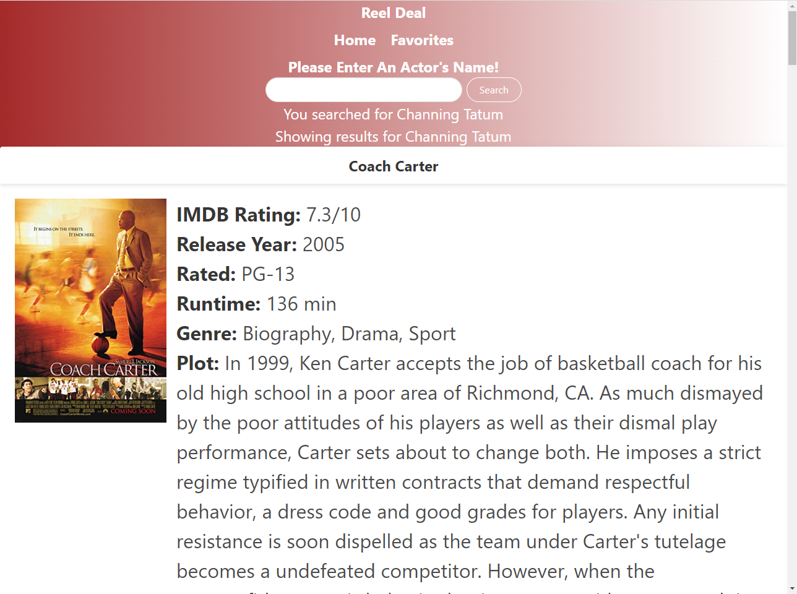
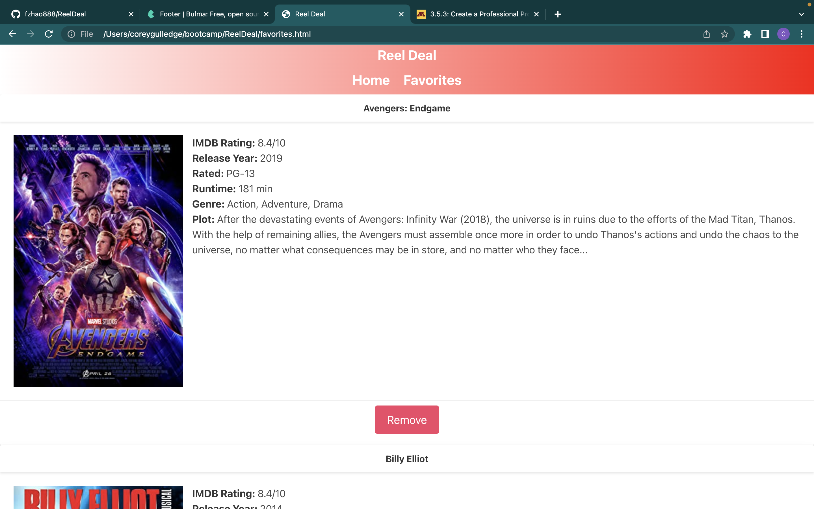

# ReelDeal

## Description

This webpage was designed to make searcging for movies easier. When you input an actors name and click search then a list of ten movies with that actor will appear. Each movie will have a picture, release year, run time, etc.. that pertain to that movie. If you find a movie you like you can save it clicking the save button. If you click on the favorites bar you will notice that saved movies get added to it. If you decide that you don't want to watch the movie anymore you can remove it by clicking the remove button.

## Installation

N/A

## Usage

This webpage can be used to find movies on any actor you want to see. Also has a favorites section so you can add multiple movies from different actors.

## Credits

Frank-fzhao88
Louis-Lokistarwind
Peter-PeterOste
Corey-gulledgecorey

## License

Please refer to license in repo.

## Features

Being able to search a certain actor and it pops up a list of their movies.
A save button to add a movie you may want to watch to a favorites section where you can also view. Also a remove button to remove a movie from your favorites section if you've watched it or just don't like it anymore.

## Screenshot
Homepage
 

Search Results page
 

Favorites page
 

## Deployment
https://fzhao888.github.io/ReelDeal/
