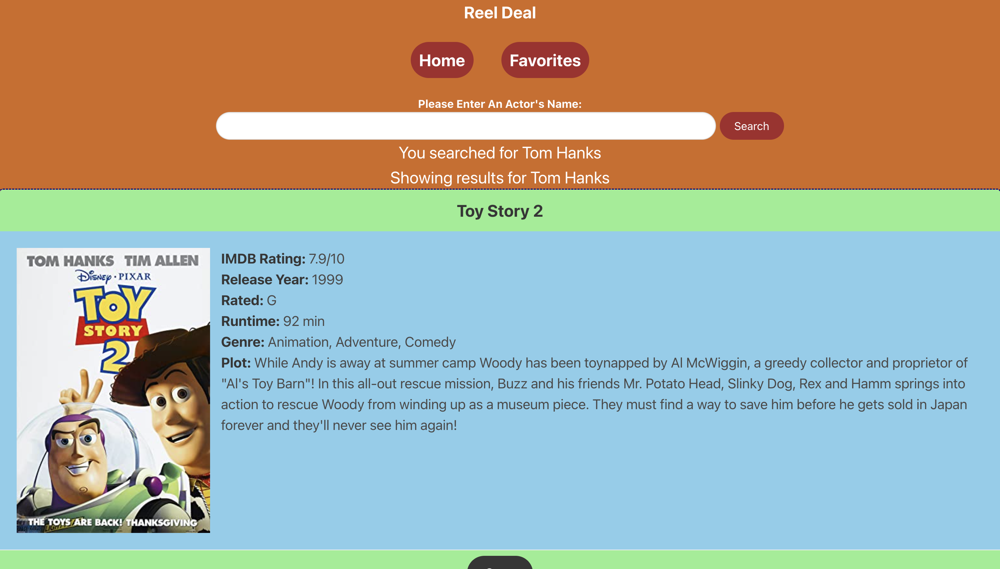
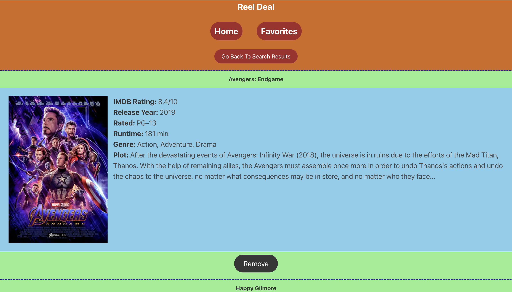

# ReelDeal

## Description

This webpage was designed to make searching for movies easier. When you input an actors name and click search, then a list of movies with that actor will appear. Each movie will have a picture, release year, run time, etc.. that pertain to that movie. If you find a movie you like, you can save it by clicking the save button. If you click on the favorites tab, you will notice that saved movies get added to it. If you decide that you do not want to watch the movie or is not a favorite anymore, you can remove it by clicking the remove button.

## Installation

N/A

## Usage

This webpage can be accessed by simply visiting https://fzhao888.github.io/ReelDeal/ .  It can be used to find movies on any actor you want to see. Also has a favorites section so you can add multiple movies from your favorite actors.

## Credits

Frank Zhao - fzhao88  
Louis Antolin - Lokistarwind  
Peter Ostertag - PeterOste  
Corey Gulledge - gulledgecorey  

## License

Please refer to license in repo.

## Features

Being able to search a certain actor and it pops up a list of their movies.  
A save button to add a movie you may want to watch to a favorites section where you can also view.  
Also a remove button to remove a movie from your favorites section if you have watched it or just do not like it anymore.  

## Screenshot

### Homepage
 

### Search Results page
 

### Favorites page
 
 

# Credits
HUGE shoutout to TA Jessica.  We could not have finished this project without her help.  She was instrumental in helping us save and remove from local storage. 
In addition, she helped us a lot in checking if our webpage was responsive and gave a lot of helpful pointers in styling our webpage.   

Shoutout to Bulma documentations ( https://bulma.io/documentation/ ). We took inspiration styling the card component, modals, button, navbar, image, and responsiveness from the Bulma documentations.    

We also used w3 school ( https://www.w3schools.com/jsref/met_his_back.asp )to help us out with the back button. 

Lastly, we also took a lot of inspiration from University of Minnesota edX bootcamp class examples.  06-Server-Side-APIs Mini Project helps get us going and helped us come out with the idea of using a result card.  

Not sure, if we need to cite our picture of the "dog", we got it from https://gallery.ryux.net/gallery.php?anime=fma&section=07&start=311&perpage=10 .
